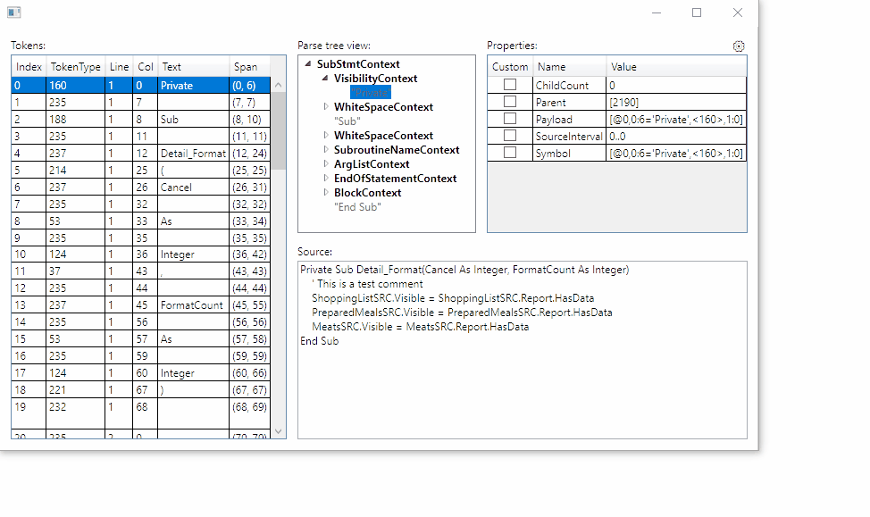
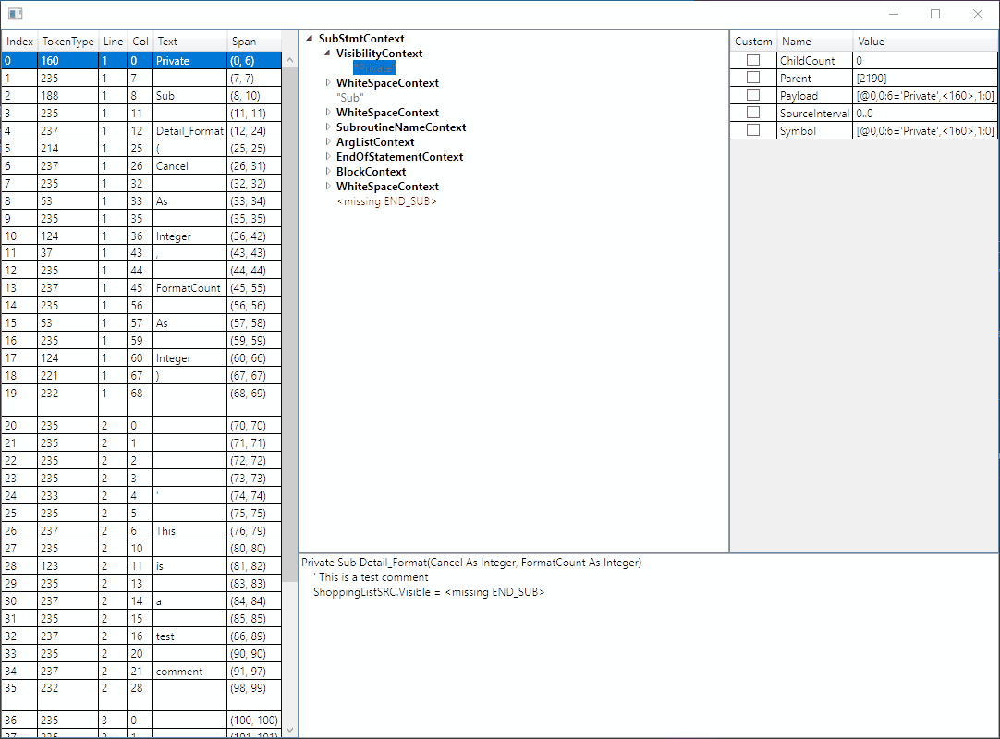

# ANTLR4 Parse Tree Visualizer

  

## Features

* List of tokens (error tokens are highlighted in red)
* Treeview of rule contexts and terminal nodes (error nodes in red)
* Properties of selected treeview node (properties not declared in the Antlr namespace are checked)
* Source view
* Rule and token names are visible after choosing a parser class

  

* Selection sync, when selecting in the token list, the tree view, or the source text.

  

This project is very much in an alpha stage. It currently only targets `RuleContext` and derived classes.

## Installation

Download the DLLs from the [releases](https://github.com/zspitz/ANTLR4ParseTreeVisualizer/releases) page, and unblock (right-click from Explorer, select **Properties** and check the **Unblock** checkbox). Alternatively, you can compile the source  yourself.

Make sure the compiled visualizer DLL matches your version of Visual Studio -- 2019 or 2017.

Save the compiled DLL in one of Visual Studio's recognized visualizer folders. You don't have to restart VS, just make sure VS is not currently in a debugging session:

* _VisualStudioInstallPath_`\Common7\Packages\Debugger\Visualizers`
* `My Documents\Visual Studio `_Version_`\Visualizers`

## Usage

1. Begin a debugging session, and break at some point.
2. Navigate to an instance of one of the visualizer target types (ATM only `RulerContext`, but can also be a subtype), in the code editor, or the Watch or Locals window. This instance can be exposed by any variable, or any expression; the type of the expression doesn't matter.
3. Click on the magnifying glass to the right of the expression.

Note that rule and token names aren't part of the `RuleContext` targeted by the visualizer; by default, tokens will be identified by their token ID, and rule contexts will be identified by the typename of the instance (e.g. `SubStmtContext`). To display the rule and token names, click on the settings gear at the top right of the window, and choose the appropriate parser class from the available classes.

## Contributing

* Test the visualizer
* Suggest ideas and enhancements ([issues](https://github.com/zspitz/ANTLR4ParseTreeVisualizer/issues/new))
* Notify about bugs ([issues](https://github.com/zspitz/ANTLR4ParseTreeVisualizer/issues/new))
* Feel free to star the project
* Provide feedback to Microsoft about [these limitations to the visualizer API](https://github.com/zspitz/ExpressionToString/wiki/External-issues)

## Roadmap

* The current visualization targets `RulerContext`. Some sort of visualization for token streams, usable from the `RulerContext` visualization, and independently.
* Parsing errors
* Live window, perhaps as a VS extension. It should be possible to select a lexer class from a lexer assembly, a parser class from a parser assembly, and display the resultant token stream and parse tree.
